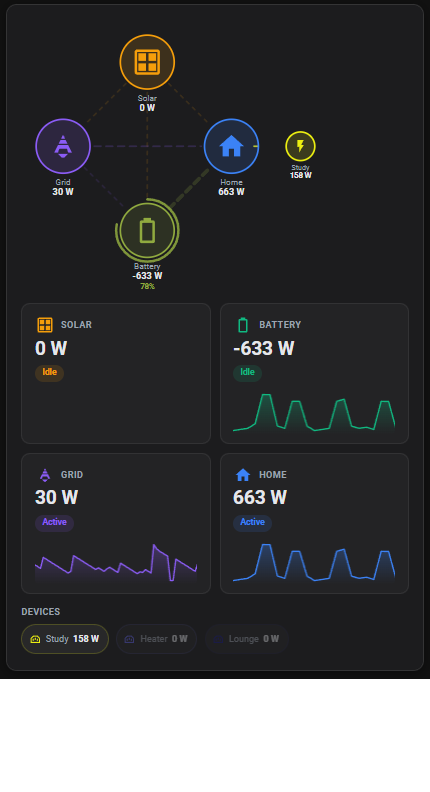

# Solar Overview Card

[](https://github.com/hacs/integration)
[](https://github.com/aistuartai/HACS-SolarOverviewCard/releases)
[](LICENSE)

A real-time solar energy overview card for Home Assistant Lovelace. Shows an animated power-flow diagram, live statistics with sparkline history, a dynamic battery SOC ring, and a scrollable device power list — all in a single compiled JS file with no external dependencies.



---

## Features

| Feature | Detail |
|---------|--------|
| **Animated flow diagram** | SVG nodes for Solar, Grid, Home, Battery with dashed flow lines that animate in the direction of current power movement. Line thickness scales with wattage. |
| **Dynamic battery ring** | SOC progress arc transitions smoothly from green (full) → amber → red (empty). |
| **Device satellite nodes** | Individual device nodes fan out from the Home node on the diagram — toggle per-device. |
| **2 × 2 stat panels** | Large current value, colour-coded state badge (Generating / Charging / Importing…), optional 2-hour sparkline. |
| **Device chip row** | Horizontal scrollable chips for individual devices, sorted by wattage. Dim when idle. |
| **4 independent grid sensors** | Separate entities for Grid→Home, Solar/Battery→Grid, Grid→Battery, Battery→Grid. Combined fallback also supported. |
| **Sign-convention invert** | Per-entity `invert: true` flag for inverters that report the opposite sign. |
| **Section toggles** | Show/hide the flow diagram, stat panels, device row, and sparklines independently. |
| **Visual config editor** | Full GUI editor with entity pickers, icon selector, colour picker, and device add/edit/delete. |
| **Responsive** | Scales from a narrow sidebar card to a full-width dashboard view. |
| **Theme-aware** | Follows HA CSS variables; override with `theme: light \| dark`. |

---

## Installation

### HACS (recommended)

1. Open **HACS** → **Frontend** → ⋮ menu → **Custom repositories**
2. Add `https://github.com/aistuartai/HACS-SolarOverviewCard` — category **Dashboard**
3. Search **Solar Overview Card** → **Download**
4. Hard-refresh your browser (`Ctrl + Shift + R`)

### Manual

1. Download `solar-overview-card.js` from the [latest release](https://github.com/aistuartai/HACS-SolarOverviewCard/releases/latest)
2. Copy to `config/www/solar-overview-card.js`
3. **Settings → Dashboards → Resources** → Add resource:
   - URL: `/local/solar-overview-card.js`
   - Type: `JavaScript module`
4. Reload browser

---

## Configuration

### Minimal example

```yaml
type: custom:solar-overview-card
solar:
  entity: sensor.solar_power
battery:
  entity: sensor.battery_power
  soc_entity: sensor.battery_soc
grid:
  entity: sensor.grid_power
load:
  entity: sensor.load_power
```

### Full example with all options

```yaml
type: custom:solar-overview-card

# ── Solar ──────────────────────────────────────────────────────────────────────
solar:
  entity: sensor.solar_power        # Generation (W ≥ 0)
  name: Solar                       # Optional display name
  icon: mdi:solar-panel             # Optional MDI icon
  export_entity: sensor.solar_export  # Explicit Solar → Grid sensor (W ≥ 0)

# ── Battery ────────────────────────────────────────────────────────────────────
battery:
  entity: sensor.battery_power      # + = charging,  − = discharging
  soc_entity: sensor.battery_soc    # State of charge 0–100 %
  name: Battery
  invert: false                     # Set true if your sensor reports + = discharging

# ── Grid — combined fallback ───────────────────────────────────────────────────
# Use `grid.entity` as a single combined sensor, OR configure the individual
# flow sensors below. Individual sensors take priority over the combined entity.
grid:
  entity: sensor.grid_power         # + = importing,  − = exporting  (fallback)

  # Individual flow sensors (each optional — override the combined entity):
  import_entity: sensor.grid_import         # Grid → Home  (W ≥ 0)
  export_entity: sensor.grid_export         # Solar/Battery → Grid  (W ≥ 0)
  battery_entity: sensor.grid_battery       # Grid ↔ Battery combined
                                            #   + = grid charges battery
                                            #   − = battery discharges to grid
  to_battery_entity: sensor.grid_to_bat     # Grid → Battery only  (W ≥ 0)
  from_battery_entity: sensor.bat_to_grid   # Battery → Grid only  (W ≥ 0)

  name: Grid
  invert: false                     # Set true if + = exporting on your meter

# ── Home load ──────────────────────────────────────────────────────────────────
load:
  entity: sensor.load_power         # Home consumption (W ≥ 0)
  name: Home

# ── Devices ────────────────────────────────────────────────────────────────────
devices:
  - entity: sensor.study_pc_power
    name: Study PC
    icon: mdi:desktop-classic
    color: "#6366f1"
    show_on_diagram: true           # Render as satellite node on flow diagram
  - entity: sensor.lounge_tv_power
    name: Lounge TV
    icon: mdi:television
    color: "#ec4899"
  - entity: sensor.aircon_power
    name: Air Con
    icon: mdi:air-conditioner
    color: "#06b6d4"

# ── Display options ─────────────────────────────────────────────────────────────
watt_threshold: 1000      # Switch to kW above this wattage (default: 1000)
show_sparklines: true     # 2-hour sparkline history in stat panels (default: true)
theme: auto               # auto | light | dark  (default: auto)

# ── Section visibility ──────────────────────────────────────────────────────────
show_flow: true           # Animated flow diagram (default: true)
show_stats: true          # 2×2 stat panels (default: true)
show_devices: true        # Device chip row (default: true)
```

---

## Grid entity guide

Most installations have a single combined grid sensor. Use `grid.entity` as the fallback and only add individual sensors if you have dedicated metering for each flow.

| Flow | Combined entity behaviour | Individual entity |
|------|--------------------------|-------------------|
| Grid → Home | `grid.entity > 0` | `grid.import_entity` |
| Solar/Battery → Grid | `grid.entity < 0` when `solar > 0` | `grid.export_entity` |
| Grid → Battery | not derivable from combined | `grid.to_battery_entity` or `grid.battery_entity > 0` |
| Battery → Grid | not derivable from combined | `grid.from_battery_entity` or `grid.battery_entity < 0` |

---

## Sign convention reference

| Entity | Positive means | Negative means |
|--------|---------------|----------------|
| `solar.entity` | Generating | — (always ≥ 0) |
| `battery.entity` | Charging ← grid/solar | Discharging → home/grid |
| `grid.entity` | Importing → home | Exporting ← solar/battery |
| `load.entity` | Consuming | — (always ≥ 0) |
| `grid.battery_entity` | Grid charging battery | Battery discharging to grid |

Add `invert: true` to any entity whose sensor reports the opposite sign.

---

## Home value calculation

The **Home** stat panel and flow-diagram node display the sum of measured inflows:

```
Home = batteryToHome + gridToHome
```

This is derived from the other sensors rather than the raw load entity, giving an accurate real-time consumption figure even when the load sensor lags.

---

## Devices on the flow diagram

Set `show_on_diagram: true` on any device to render it as a smaller satellite node connected to the Home node. Nodes are positioned automatically to the right of Home and scale/dim based on current wattage.

```yaml
devices:
  - entity: sensor.study_power
    name: Study
    color: "#6366f1"
    show_on_diagram: true
```

---

## Building from source

```bash
git clone https://github.com/aistuartai/HACS-SolarOverviewCard.git
cd HACS-SolarOverviewCard
npm install
npm run build    # → dist/solar-overview-card.js
npm run dev      # watch mode
```

Requires Node.js ≥ 18.

---

## Contributing

Pull requests are welcome.

1. Fork and create a feature branch
2. Run `npm run lint` — fix any issues
3. For visual changes, include a screenshot in the PR
4. Open a PR against `main`

Bug reports and feature requests → [GitHub Issues](https://github.com/aistuartai/HACS-SolarOverviewCard/issues)

---

## License

[MIT](LICENSE)
