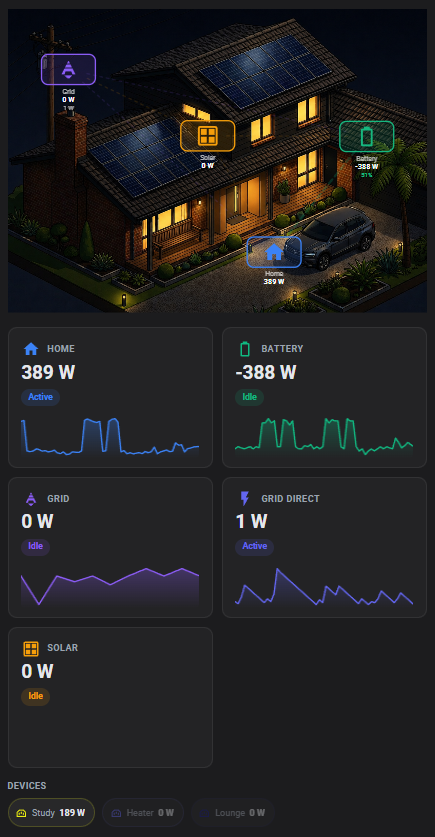

# Solar Overview Card

[](https://github.com/hacs/integration)
[](https://github.com/aistuartai/HACS-SolarOverviewCard/releases)
[](LICENSE)

A real-time solar energy overview card for Home Assistant Lovelace. Shows an animated power-flow diagram, live statistics with sparkline history, a dynamic battery SOC ring, and a scrollable device power list — all in a single compiled JS file with no external dependencies.



---

## Features

| Feature | Detail |
|---------|--------|
| **Animated flow diagram** | SVG nodes for Solar, Grid, Home, Battery with dashed flow lines that animate in the direction of current power movement. Line thickness scales with wattage. |
| **Custom background image** | Set any image (local `/local/` path or URL) as the flow diagram background via `flow_background`. |
| **Dynamic battery SOC** | SOC % shown on the battery node. In `circle` mode: animated arc ring transitioning red → amber → green. In `card` mode: colour-coded percentage text. |
| **Device satellite nodes** | Individual device nodes fan out from the Home node on the diagram — toggle per-device. |
| **2 × 2 stat panels** | Large current value, colour-coded state badge (Generating / Charging / Importing…), optional sparkline history. |
| **Device chip row** | Horizontal scrollable chips for individual devices, sorted by wattage. Dim when idle. |
| **4 independent grid sensors** | Separate entities for Grid→Home, Solar/Battery→Grid, Grid→Battery, Battery→Grid. Combined fallback also supported. |
| **Sign-convention declaration** | `positive_means: charging\|discharging` on battery and `positive_means: importing\|exporting` on grid — explicit semantic declaration replaces the binary `invert` flag. The old `invert` flag still works for backward compatibility. |
| **Battery status entity** | Optional `battery.status_entity` reads a text sensor (e.g. "Charging" / "Discharging" / "Idle") and uses it as the state label instead of inferring from power value. |
| **Auto-derived grid→battery flow** | When no explicit `to_battery_entity` is configured, the card automatically infers how much grid power is going to the battery: `gridToBattery = batteryCharging − solarToBattery`. Grid→Home is then corrected by subtracting that amount. No extra sensors needed. |
| **Section toggles** | Show/hide the flow diagram, stat panels, device row, and sparklines independently. |
| **Draggable node layout** | Drag nodes in the visual editor to reposition them; positions are saved to config. |
| **Node style** | Choose `circle` (default) or `card` style for all diagram nodes. |
| **Tap for more info** | Stat panels and device chips open Home Assistant's more-info dialog. |
| **Resizable diagram nodes** | `node_size` scales the flow diagram nodes; icons scale with them. |
| **Unit-aware sensors** | Sensors reporting kW or MW are scaled to watts automatically. |
| **Visual config editor** | Full GUI editor with entity pickers, icon selector, colour picker, and device add/edit/delete. |
| **Responsive** | Scales from a narrow sidebar card to a full-width dashboard view. |
| **Theme-aware** | Follows HA CSS variables; override with `theme: light \| dark`. |

---

## Installation

### HACS (recommended)

1. Open **HACS** → **Frontend** → ⋮ menu → **Custom repositories**
2. Add `https://github.com/aistuartai/HACS-SolarOverviewCard` — category **Dashboard**
3. Search **Solar Overview Card** → **Download**
4. Hard-refresh your browser (`Ctrl + Shift + R`)

### Manual

1. Download `solar-overview-card.js` from the [latest release](https://github.com/aistuartai/HACS-SolarOverviewCard/releases/latest)
2. Copy to `config/www/solar-overview-card.js`
3. **Settings → Dashboards → Resources** → Add resource:
   - URL: `/local/solar-overview-card.js`
   - Type: `JavaScript module`
4. Reload browser

---

## Configuration

### Minimal example

```yaml
type: custom:solar-overview-card
solar:
  entity: sensor.solar_power
battery:
  entity: sensor.battery_power
  soc_entity: sensor.battery_soc
grid:
  entity: sensor.grid_power
load:
  entity: sensor.load_power
```

### Full example with all options

```yaml
type: custom:solar-overview-card

# ── Solar ──────────────────────────────────────────────────────────────────────
solar:
  entity: sensor.solar_power        # Generation (W ≥ 0)
  name: Solar                       # Optional display name
  icon: mdi:solar-panel             # Optional MDI icon
  export_entity: sensor.solar_export  # Explicit Solar → Grid sensor (W ≥ 0)

# ── Battery ────────────────────────────────────────────────────────────────────
battery:
  entity: sensor.battery_power      # signed power sensor
  soc_entity: sensor.battery_soc    # State of charge 0–100 %
  positive_means: charging          # 'charging' (default) or 'discharging'
                                    # Replaces the old invert flag — invert still works
  status_entity: sensor.battery_status  # Optional text sensor: "Charging"/"Discharging"/"Idle"
  name: Battery

# ── Grid — combined fallback ───────────────────────────────────────────────────
# Use `grid.entity` as a single combined sensor, OR configure the individual
# flow sensors below. Individual sensors take priority over the combined entity.
# When only grid.entity is configured, grid→battery flow is auto-derived from
# the battery charging value (no extra sensors needed).
grid:
  entity: sensor.grid_power         # + = importing,  − = exporting  (fallback)
  positive_means: importing         # 'importing' (default) or 'exporting'
                                    # Replaces the old invert flag — invert still works

  # Individual flow sensors (each optional — override the combined entity):
  export_entity: sensor.grid_export         # Solar/Battery → Grid  (W ≥ 0)
  battery_entity: sensor.grid_battery       # Grid ↔ Battery combined
                                            #   + = grid charges battery
                                            #   − = battery discharges to grid
  to_battery_entity: sensor.grid_to_bat     # Grid → Battery only  (W ≥ 0)
  from_battery_entity: sensor.bat_to_grid   # Battery → Grid only  (W ≥ 0)

  name: Grid

# ── Home load ──────────────────────────────────────────────────────────────────
load:
  entity: sensor.load_power         # Home consumption (W ≥ 0)
  name: Home

# ── Devices ────────────────────────────────────────────────────────────────────
devices:
  - entity: sensor.study_pc_power
    name: Study PC
    icon: mdi:desktop-classic
    color: "#6366f1"
    show_on_diagram: true           # Render as satellite node on flow diagram
  - entity: sensor.lounge_tv_power
    name: Lounge TV
    icon: mdi:television
    color: "#ec4899"
  - entity: sensor.aircon_power
    name: Air Con
    icon: mdi:air-conditioner
    color: "#06b6d4"

# ── Display options ─────────────────────────────────────────────────────────────
watt_threshold: 1000      # Switch to kW above this wattage (default: 1000)
show_sparklines: true     # Sparkline history in stat panels (default: true)
sparkline_hours: 2        # Hours of history to fetch for sparklines (default: 2)
theme: auto               # auto | light | dark  (default: auto)

# ── Section visibility ──────────────────────────────────────────────────────────
show_flow: true           # Animated flow diagram (default: true)
show_stats: true          # 2×2 stat panels (default: true)
show_devices: true        # Device chip row (default: true)

# ── Flow diagram appearance ─────────────────────────────────────────────────────
flow_background: /local/solar-bg.png   # Background image for the flow diagram
                                       # Accepts /local/ paths or any URL
diagram_text_color: "#ffffff"          # Colour for all node labels/values (default: white)
node_style: circle                     # circle (default) or card
node_size: 32                          # Node radius (default: 32, useful range 20-64)
                                       # Card-style nodes scale to match
node_icon_size: 18                     # Icon size (default: scales with node_size)
show_flow_lines: true                  # Animated dashed flow lines (default: true)

# ── Node colour overrides ───────────────────────────────────────────────────────
solar:
  color: "#f59e0b"         # Override solar node colour
battery:
  color: "#10b981"         # Override battery node colour (overrides SOC-dynamic colour)
grid:
  color: "#8b5cf6"         # Override grid node colour
load:
  color: "#3b82f6"         # Override home node colour

# ── Secondary entity labels on diagram nodes ────────────────────────────────────
solar:
  secondary_entity: sensor.solar_string_b   # Second line shown below value on Solar node
battery:
  secondary_entity: sensor.battery_temp     # e.g. status or temperature
grid:
  secondary_entity: sensor.grid_meter       # e.g. import meter reading
load:
  secondary_entity: sensor.submeter_power   # e.g. sub-metered consumption

# ── Custom node positions ───────────────────────────────────────────────────────
# Set via drag-and-drop in the Layout editor; or manually:
node_positions:
  solar:   { x: 150, y: 50 }
  grid:    { x: 50,  y: 150 }
  home:    { x: 250, y: 150 }
  battery: { x: 150, y: 250 }

# ── Stat panel order & custom panels ───────────────────────────────────────────
panels:
  - key: solar                  # Built-in panels: solar, battery, grid, load
    enabled: true
  - key: battery
    enabled: true
  - key: grid
    enabled: true
  - key: load
    enabled: true
  - key: load
    name: Consumption           # Optional: rename a built-in panel
    icon: mdi:home-lightning-bolt   # Optional: override its icon
    enabled: true
  - entity: sensor.house_temperature   # Custom panel — any HA entity
    name: Temperature
    icon: mdi:thermometer            # Optional (default: lightning bolt)
    color: "#06b6d4"
    enabled: true
```

Panel names are displayed in capitals, so `name: Meter` renders as **METER**.

Icons accept any MDI name (`mdi:meter-electric`) or a raw SVG path. Both
built-in and custom panels support `name`, `icon` and `color`; all three are
editable in the visual editor's **Stat Panels** page.

---

## Grid entity guide

Most installations have a single combined grid sensor. Use `grid.entity` as the fallback and only add individual sensors if you have dedicated metering for each flow.

| Flow | Combined entity behaviour | Individual entity |
|------|--------------------------|-------------------|
| Grid → Home | `grid.entity > 0` minus auto-derived gridToBattery | `grid.import_entity` |
| Solar/Battery → Grid | `grid.entity < 0` when `solar > 0` | `grid.export_entity` |
| Grid → Battery | **auto-derived**: `batteryCharging − solarToBattery` | `grid.to_battery_entity` or `grid.battery_entity > 0` |
| Battery → Grid | not derivable from combined | `grid.from_battery_entity` or `grid.battery_entity < 0` |

---

## Sign convention reference

| Entity | Default: positive means | Default: negative means |
|--------|------------------------|------------------------|
| `solar.entity` | Generating | — (always ≥ 0) |
| `battery.entity` | Charging ← grid/solar | Discharging → home/grid |
| `grid.entity` | Importing → home | Exporting ← solar/battery |
| `load.entity` | Consuming | — (always ≥ 0) |
| `grid.battery_entity` | Grid charging battery | Battery discharging to grid |

If your sensor reports the opposite sign, declare it explicitly:

```yaml
battery:
  positive_means: discharging   # sensor is positive when discharging
grid:
  positive_means: exporting     # sensor is positive when exporting
```

The old `invert: true` flag still works as an alias for `positive_means: discharging` / `positive_means: exporting`.

---

## Home value calculation

When `load.entity` is configured, the **Home** stat panel shows that sensor value directly (most accurate).

When no load entity is configured, the card derives home consumption from flows:

```
Home = solarToHome + batteryToHome + gridToHome
```

The flow diagram always uses the calculated flow breakdown to animate power movement correctly.

---

## Flow diagram background image

Set a custom background image behind the flow diagram nodes using `flow_background`. Accepts any `/local/` path (files placed in `config/www/`) or a full URL.

```yaml
flow_background: /local/solar-bg.png
```

The image fills the diagram area (`preserveAspectRatio="xMidYMid slice"`). Pair with `diagram_text_color` if your image needs lighter or darker text:

```yaml
flow_background: /local/solar-bg.png
diagram_text_color: "#ffffff"   # white (default)
```

Set via the **Setup → Flow diagram background** field in the visual editor, or directly in YAML.

---

## Devices on the flow diagram

Set `show_on_diagram: true` on any device to render it as a smaller satellite node connected to the Home node. Nodes are positioned automatically to the right of Home and scale/dim based on current wattage.

```yaml
devices:
  - entity: sensor.study_power
    name: Study
    color: "#6366f1"
    show_on_diagram: true
```

---

## Building from source

```bash
git clone https://github.com/aistuartai/HACS-SolarOverviewCard.git
cd HACS-SolarOverviewCard
npm install
npm run build    # → dist/solar-overview-card.js
npm run dev      # watch mode
```

Requires Node.js ≥ 18.

---

## Contributing

Pull requests are welcome.

1. Fork and create a feature branch
2. Run `npm run lint` — fix any issues
3. For visual changes, include a screenshot in the PR
4. Open a PR against `main`

Bug reports and feature requests → [GitHub Issues](https://github.com/aistuartai/HACS-SolarOverviewCard/issues)

---

## License

[MIT](LICENSE)
